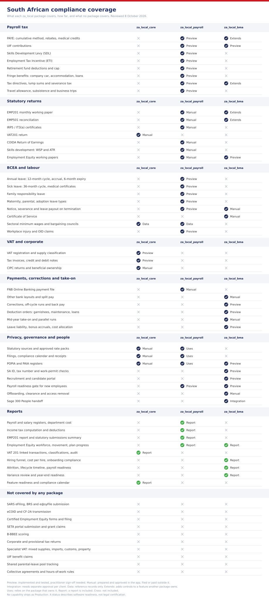

<div align="center">


# SA Localisation Finance &amp; Compliance

**South African VAT, tax documents and the statutory governance foundation for Frappe and ERPNext**

[](https://github.com/EPIUSECX/za_local_core/actions/workflows/ci.yml)
[](license.txt)
[](https://frappeframework.com)

</div>

## What this app is

This app does two jobs. It makes ERPNext behave like a South African VAT vendor,
and it is the governance foundation the rest of the suite depends on. VAT arrived
here from the separate `za_local_finance` app, which is retired from 2.0.0; every
localisation site needs the foundation, and in practice every one of them settles
a ledger too.

As the VAT vendor it classifies supplies, applies the VAT Act's tax-invoice
particulars to commercial documents, and builds a VAT201 working paper that
reconciles back to the ledger entries that produced it.

As the foundation it answers the questions every South African compliance feature
depends on:

- Which statutory rule applies to this company, on this date, and who approved it?
- Is this capability ready for production use, or does it still need a human?
- Which obligation is due, who prepared the filing, and what did the authority
  send back?
- Where is the evidence, and can it be altered after approval?

It also owns the shared Desk experience, so the suite presents itself as one
**SA Localisation** application rather than three separate apps.

## Why it exists

South African statutory values change every year, and several of them change
mid-year. A payroll or VAT engine that hard-codes a rate is wrong the moment the
gazette moves — and worse, it is wrong silently.

This app makes the provenance of every statutory value explicit and
date-effective. A rate is usable only when it is attached to a recorded source,
carries effective dates, and has been approved by someone other than its author.
Rules are never guessed, and never resolved against today's date when the
transaction date is known.

## Key features

- **Company Compliance Profile** — records which obligations actually apply to a
  company, so a business that is not a designated employer or not a VAT vendor is
  never asked for returns it does not owe.
- **Statutory Sources** — immutable records of the gazette, guide or BRS a rule
  came from, with publication date, URL and evidence checksum.
- **Statutory Rate Packs** — effective-dated, reviewer-approved values with
  overlap rejection, so two packs can never both claim the same date.
- **Compliance Obligations and Calendar** — what is due, for which period, by when.
- **Filings and Submission Receipts** — separation of preparer and approver, plus
  a place to capture the authority's actual acknowledgement.
- **Feature Readiness** — every capability in the suite declares whether it is
  Production, Controlled Manual, Preview, Unsupported or Blocked, with the reason
  and the remediation route.
- **POPIA and PAIA registers** — Information Officer registrations, processing
  activities, retention schedules, operator agreements, cross-border transfers,
  data-subject requests, personal-information incidents and PAIA manuals.
- **Shared Desk shell** — one SA Localisation app tile and workspace switcher
  across every installed domain.

### VAT

- **South Africa VAT Settings** — company-scoped VAT registration, category and
  account mapping, with posting accounts validated as enabled tax ledgers.
- **Supply classification** — standard-rated, zero-rated and exempt supplies,
  capital and non-capital inputs, and local versus imported input tax.
- **Tax-invoice controls** — full tax invoice, abridged tax invoice and
  no-invoice-required thresholds resolved from an approved rate pack, with a
  readiness check that lists exactly which VAT Act particulars are missing.
- **Commercial print formats** — SA sales invoice, full and abridged tax invoice,
  credit and debit note, purchase invoice, quotation, sales and purchase order,
  delivery note and payment entry.
- **VAT201 Return** — period-scoped working paper with source-to-ledger
  reconciliation, an immutable snapshot on submission, and maker-checker review
  before filing.
- **Reports** — VAT 201 Linked Transactions, VAT 201 Account Classifications and
  a VAT Audit Report, all permission-filtered.
- **Chart of Accounts augmentation** — South African VAT ledgers created without
  overwriting a company's existing accounting configuration.

## Country scope

Every statutory rule in this suite is gated on the company's country. A site may
hold companies in several countries; those outside South Africa keep stock
Frappe, ERPNext and HRMS behaviour and are never blocked by South African setup
they cannot complete.

`za_local_core.localisation.is_south_african_company` is the single owner of that
decision. A blank or unknown company is treated as out of scope, so an incomplete
document is reported by its own DocType rather than by a localisation error.

VAT is additionally opt-in per company: the features stay inert until a company
has South Africa VAT Settings, the customer VAT-number check fires only for tax
IDs explicitly marked as South African VAT registrations, and the item and invoice
hooks return early otherwise. A company that is not a VAT vendor is unaffected by
this app's presence.

## Capability status

| Capability | Status | What that means |
| --- | --- | --- |
| Statutory source, rate and filing governance | Controlled Manual | A designated reviewer approves source evidence, effective dates and each production feature |
| POPIA and PAIA registers | Controlled Manual | The app records controls and evidence; regulator submissions, legal interpretation and incident-notification decisions remain accountable-person duties |
| VAT201 working paper | Controlled Manual | Prepared, reconciled and approved in-app; submitted to SARS eFiling by a person, with the receipt captured as evidence |
| Tax invoices and credit/debit notes | Preview | Controls are implemented and tested; company-specific supply treatment still needs practitioner sign-off |
| Corporate and provisional tax | Preview | Catalogue entry only — no working papers or filing integration are implemented |
| CIPC annual returns and beneficial ownership | Controlled Manual | The portal process remains entirely external |

### VAT scenarios not implemented

Specialist VAT scenarios are out of scope in this release and need practitioner
handling: apportionment of mixed taxable and exempt supplies, imported services,
customs added-tax value, second-hand goods and notional input tax, fixed
property, change in use, bad-debt timing, the gold reverse charge, diesel refunds
and payments-basis vendors.

Read the live values in the Desk under **SA Overview → Feature Readiness**. No
capability in this suite ships as Production until an authorised reviewer sets it.

<!-- za-local-coverage-matrix:start -->
## South African compliance coverage

This matrix is the same in every package of the suite. The graphic gives the answer at a
glance; the tables below it give the detail and what stays outside the app. Read the live values in
the Desk under **SA Overview → Feature Readiness**.



A green tick means the capability is included in that package. The words beside it say what is still yours to do: **Sign-off needed** is the Preview status, **Filed outside app** is Controlled Manual.

| Package | What it adds |
| --- | --- |
| `za_local_core` | VAT, tax invoices, VAT201, and the shared governance foundation: statutory sources, rate packs, filings, POPIA and PAIA registers |
| `za_local_payroll` | Payroll and statutory payroll returns, BCEA leave and termination, Employment Equity, skills development and COIDA |
| `za_local_bma` | Recruitment, employee lifecycle and Payroll Operations around the payroll engine |

**Reading the matrix**

| Mark | Meaning |
| --- | --- |
| Preview | Implemented and tested. A practitioner must sign off client-specific treatment before production use |
| Controlled Manual | The app prepares, reconciles and approves. The filing, payment or decision happens outside the app, and a person records the receipt |
| Controlled Integration | A flow exists, but every endpoint, mapping and credential needs separate approval |
| Data only | Reference records the app stores or uses. It does not calculate or decide |
| Extends | Adds controls around a feature that another package owns |
| — | Not part of this package |

No capability ships as Production. A status describes the software's readiness, not
legal certification. Rates are only as current as the approved rate packs.

### Payroll tax and statutory returns

| Obligation | core | payroll | bma | Stays outside the app |
| --- | --- | --- | --- | --- |
| PAYE (Income Tax Act, Fourth Schedule): cumulative year-to-date method, age rebates, medical credits, retirement cap, annual payments such as bonuses | — | Preview | Extends: corrections, off-cycle runs, back pay | Annual approval of rates; PAYE is declared through EMP201 |
| UIF contributions | — | Preview | Preview: UIF declaration data | Declarations and payments to the Fund |
| Skills Development Levy | — | Preview | — | Payment through EMP201 |
| Employment Tax Incentive | — | Preview | — | Claim through EMP201 |
| Retirement funds and medical scheme credits | — | Preview | — | Fund returns |
| Fringe benefits (Seventh Schedule): company car, accommodation, low-interest loan | — | Preview | — | Other benefits need practitioner evidence for valuation |
| Tax directives, lump sums and severance tax | — | Preview | Extends: termination pay waits for the directive | Obtaining the directive from SARS |
| Travel allowance, subsistence and business trips | — | Preview | — | Practitioner review of reimbursive rates |
| EMP201 monthly declaration | — | Controlled Manual | Extends: period locks after EMP201 | Submission and payment on SARS eFiling |
| IRP5 / IT3(a) and EMP501 reconciliation | — | Controlled Manual | Extends: Year-End Readiness report | No SARS BRS import file and no e@syFile submission |
| Payroll bank files | — | Controlled Manual: FNB Online Banking CSV | Controlled Manual: further bank layouts, split pay | Bank acceptance test and portal authorisation |
| Deduction orders: maintenance, garnishees, staff loans | — | — | Preview | Court orders, caps and consent are the client's decision |
| Mid-year take-on and parallel runs | — | — | Controlled Manual | Review of each source export |
| Leave liability, bonus accruals, cost allocation | — | — | Preview | Valuation basis agreed with the client and auditor |

### Labour and workplace

| Obligation | core | payroll | bma | Stays outside the app |
| --- | --- | --- | --- | --- |
| BCEA leave: annual, sick (36-month cycle), family responsibility, maternity, parental, adoption | — | Preview: Leave Types, draft policies, cycle assignment, sick-leave allocator | — | Part-time and variable hours, collective agreements, shared parental-leave pool |
| BCEA termination: notice, severance, leave payout | — | Preview | Controlled Manual: resignation notice is the greater of contract and BCEA notice | Hours-of-work rules, earnings-threshold effects, case law |
| Certificate of Service | — | — | Controlled Manual | Legal review of wording |
| Sectoral minimum wages and bargaining councils | Data only: rate pack | Data only | — | Council agreements and determinations |
| Employment Equity (EEA) | — | Controlled Manual: working papers, not certified EEA forms | Preview: voluntary EE declaration, applicant EE mix | Nothing is filed with the Department |
| Skills development: WSP, ATR, SETA records | — | Controlled Manual | — | SETA portal, grants, B-BBEE scoring |
| COIDA Return of Earnings | — | Controlled Manual | — | eCOID submission and assessment response |
| Workplace injury and OID claims | — | Preview | — | Choosing the applicable report, deadline and disease process |

### VAT and corporate compliance

| Obligation | core | payroll | bma | Stays outside the app |
| --- | --- | --- | --- | --- |
| VAT registration, supply classification, tax-invoice controls | Preview | — | — | Company-specific supply treatment |
| Tax invoices, credit and debit notes | Preview | — | — | Practitioner sign-off |
| VAT201 return | Controlled Manual | — | — | Submission on SARS eFiling |
| Specialist VAT: mixed supplies, imported services, customs, second-hand goods, fixed property, bad debts, gold, diesel refunds, payments basis | Not implemented | — | — | Practitioner handling |
| Corporate and provisional tax | Catalogue entry only | — | — | Everything |
| CIPC annual returns and beneficial ownership | Controlled Manual | — | — | The portal process |

### Privacy, governance and people lifecycle

| Obligation | core | payroll | bma | Stays outside the app |
| --- | --- | --- | --- | --- |
| Statutory sources and effective-dated rate packs with independent approval | Controlled Manual | Uses it | — | Obtaining and reviewing the publications |
| Compliance obligations, calendar, filings and submission receipts | Controlled Manual | Uses it for EMP201 and EMP501 | — | The authority's acknowledgement |
| POPIA and PAIA registers | Controlled Manual | Restricted access to health and EE data | Preview: candidate consent, retention schedule, de-identification (off by default) | Regulator submissions and incident-notification decisions |
| Recruitment, candidate portal, SA ID and tax-number checks, work permits | — | — | Preview | Client approval matrix, notice wording, POPIA review |
| Preboarding and payroll readiness (identity, bank, tax, UIF) | — | Employee SA fields | Preview | First-payslip reconciliation |
| Offboarding, clearance and access removal | — | — | Controlled Manual | External-system revocation |
| Sage 300 People handoff | — | — | Controlled Integration | Each client endpoint and credential |

### Not covered by any package

SARS BRS and e@syFile transmission, eFiling submission, eCOID and CF-2A transmission,
certified Employment Equity forms and filing, SETA portal submission and grant
eligibility, B-BBEE scoring, corporate and provisional tax, the specialist VAT
scenarios above, UIF benefit claims, bargaining-council determinations, and tracking
of the shared maternity and parental-leave pool.

*Reviewed 8 October 2026 against `za_local_core` 2.0.0, `za_local_payroll` 2.1.0 and
`za_local_bma` 0.1.0. Update this section in all three READMEs together.*
<!-- za-local-coverage-matrix:end -->

## Under the hood

- [Frappe Framework](https://frappeframework.com) — the DocType model,
  permissions, background jobs and Desk UI this app is built on.
- [ERPNext](https://erpnext.com) — supplies the Company model the compliance
  profile hangs off.
- **No HRMS dependency.** A site that never runs payroll installs this app alone
  and gets VAT plus the governance foundation.

## The suite

```
ERPNext
└── za_local_core            VAT, tax invoices, VAT201, and the governance
    │                        foundation: sources, rate packs, filings, POPIA/PAIA
    └── za_local_payroll     PAYE, UIF, SDL, ETI, EMP201/501, IRP5,
                             BCEA, Employment Equity, skills, COIDA   (+ HRMS)
```

Install in that order. Each app declares its `required_apps`, so bench enforces
it as well.

## Production setup

```bash
bench get-app za_local_core https://github.com/EPIUSECX/za_local_core.git --branch main
bench --site <your-site> install-app za_local_core
bench --site <your-site> migrate
```

Then create a **ZA Company Compliance Profile** for each South African company,
and open **SA VAT → South Africa VAT Settings** for each VAT vendor to confirm the
registration details, VAT category and account mapping before raising a document.
Installation creates schema and defaults; it never rewrites an existing company's
VAT mapping or Accounts Settings.

Do not run this suite alongside the legacy `za_local` monolith on the same active
site: duplicate modules and controllers create ambiguous ownership. Rehearse a
populated legacy upgrade on an isolated clone and keep a separate rollback bench.

Before a first live period, read [VALIDATION_AND_SIGNOFF.md](VALIDATION_AND_SIGNOFF.md)
for the evidence this release carries and the human gates it does not replace, and
[CUTOVER_RUNBOOK.md](CUTOVER_RUNBOOK.md) for the controlled cutover and rollback
procedure.

## Development setup

```bash
bench get-app za_local_core /path/to/za_local_core
bench --site <dev-site> install-app za_local_core
bench --site <dev-site> set-config allow_tests true
bench --site <dev-site> run-tests --app za_local_core
```

Static checks from the bench root:

```bash
uvx ruff check apps/za_local_core
uvx ruff format --check apps/za_local_core
```

Tests create and submit documents. Run them on a disposable site or an approved
restored copy, never on a production site.

## Documentation

| Document | Purpose |
| --- | --- |
| [VALIDATION_AND_SIGNOFF.md](VALIDATION_AND_SIGNOFF.md) | Release evidence, country scope, uninstall contract, outstanding human gates |
| [CUTOVER_RUNBOOK.md](CUTOVER_RUNBOOK.md) | Cutover, rehearsal and rollback procedure |
| [MIGRATION_PLAN.md](MIGRATION_PLAN.md) | What this app owns and how it was extracted |
| [MULTI_APP_MIGRATION_PROGRAMME.md](MULTI_APP_MIGRATION_PROGRAMME.md) | Cross-repository migration waves |
| [CHANGELOG.md](CHANGELOG.md) | Release history |
| [SECURITY.md](SECURITY.md) | Reporting a vulnerability |
| [docs/STATUTORY_SOURCES.md](docs/STATUTORY_SOURCES.md) | The published sources behind the VAT values in use |
| [SUPPORT.md](SUPPORT.md) | Getting help |

### On-site guides

Practitioner and end-user guides ship as Markdown under each app's
`practitioner_guide/content/`. That packaged Markdown is authoritative; Frappe
Wiki is only a rendering target, and nothing is published unless someone asks for
it — publication writes website content, so an install or migrate never does it
behind your back.

With [Frappe Wiki](https://github.com/frappe/wiki) installed, a System Manager
publishes from **SA Overview → Publish Localisation Guides**, or from the shell:

```bash
bench --site <site> execute za_local_core.practitioner_guide.stage.stage_space
```

Either route builds `/sa-guide` and `/sa-user-guide` from every installed
localisation app, and is safe to repeat: pages are rewritten in place, pages no
longer declared by any installed app are withdrawn, and pages added by hand inside
those spaces are left alone. Without Wiki the Desk page explains the position and
offers no publish button.

## Filing boundary

This suite prepares statutory working papers. It does **not** submit them.

SARS, the Department of Employment and Labour, the Compensation Fund, SETAs and
CIPC submissions are **Controlled Manual** unless a separately approved
integration is configured. Record the authority's acknowledgement as a Submission
Receipt; a generated PDF, CSV or XML is not evidence that a return was accepted.

Installing this app does not make an employer or vendor compliant, and nothing
here is a legal certification.

## Uninstalling

`bench uninstall-app` removes this suite's DocTypes and every schema
customisation it owns: Custom Fields, Property Setters, Print Formats, Pages and
Workspaces all carry an owning module. Two things have no module for Frappe to
reclaim them by, so this app removes them itself — the `ZA Compliance` roles, and
any guide pages published into Frappe Wiki.

Guide withdrawal is scoped. Uninstalling one domain app takes away only the pages
that app published, plus any group left empty. Uninstalling core removes the
`/sa-guide` and `/sa-user-guide` spaces — unless a space also holds pages this
suite did not publish, in which case only ours are withdrawn and the space is
kept, because deleting a Wiki Space cascades to everything beneath it.

Business and audit records are deliberately retained. Salary Components, Payroll
Periods, Income Tax Slabs, approved statutory sources, rate packs, filings and
submission receipts are a company's payroll and compliance history, not app
schema. Remove them only through a reviewed data decision.

## Contributing

Install the repository's pre-commit hooks before changing code:

```bash
cd apps/za_local_core
pre-commit install
```

Ruff, ESLint, Prettier and pyupgrade run on commit. A change to a statutory value
must arrive with its source record, its effective dates and a test.

## License

MIT — see [license.txt](license.txt).
